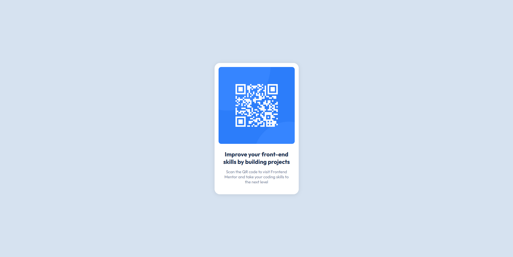

# Frontend Mentor - QR code component solution

This is a solution to the [QR code component challenge on Frontend Mentor](https://www.frontendmentor.io/challenges/qr-code-component-iux_sIO_H). Frontend Mentor challenges help you improve your coding skills by building realistic projects.

## Table of contents

- [Overview](#overview)
  - [Screenshot](#screenshot)
  - [Built with](#built-with)
  - [What I learned](#what-i-learned)
  - [Useful resources](#useful-resources)
- [Author](#author)

## Overview

### Screenshot

### Built with

- HTML
- CSS

### What I learned

A good come back for me into the html and css world. I enjoyed rediscovering the languages.

### Useful resources

- [CSS cards](https://www.w3schools.com/howto/howto_css_cards.asp)

## Author

- Frontend Mentor - [@Qheuss](https://www.frontendmentor.io/profile/Qheuss)
- LinkedIn - [Quentin Heusse](https://www.linkedin.com/in/quentin-heusse/)
